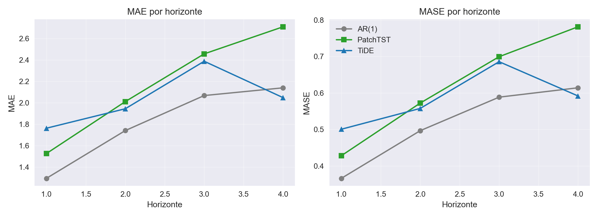

# Comparação TiDE x PatchTST

TiDE e PatchTST viraram “rivais” naturais desde que apareceram como alternativas profundas para séries temporais: TiDE aposta em um MLP temporal com skip connections para capturar dependências de longo alcance, enquanto o PatchTST reinterpreta a série como patches e usa atenção multi-head para extrair padrões locais e globais. Na prática, PatchTST costuma dominar em tarefas univariadas ou com poucas exógenas, e TiDE ganha flexibilidade quando queremos usar várias covariáveis futuras — o que reforça a rivalidade entre os dois quando precisamos escolher um único stack.

Nos dados atuais usamos TiDE com as exógenas futuras (month, weekofyear, inv, users) e PatchTST em modo univariado (a versão do NeuralForecast não aceita futr_exog). Abaixo, os resultados do walk-forward (h=4) e um baseline AR(1):

## Resultados (MAE/MASE por horizonte)

| Modelo    | h | MAE      | MASE     |
|-----------|---|----------|----------|
| AR(1)     | 1 | 1.294061 | 0.366071 |
| AR(1)     | 2 | 1.740501 | 0.496655 |
| AR(1)     | 3 | 2.067879 | 0.588498 |
| AR(1)     | 4 | 2.140056 | 0.614198 |
| PatchTST  | 1 | 1.525696 | 0.428045 |
| PatchTST  | 2 | 2.011351 | 0.572266 |
| PatchTST  | 3 | 2.457415 | 0.699319 |
| PatchTST  | 4 | 2.710433 | 0.781281 |
| TiDE      | 1 | 1.762524 | 0.500623 |
| TiDE      | 2 | 1.944531 | 0.557649 |
| TiDE      | 3 | 2.388304 | 0.685611 |
| TiDE      | 4 | 2.048312 | 0.591780 |

Leituras rápidas:
- PatchTST abriu vantagem no h=1–3, como esperado para um modelo patchificado com foco local; perde no h=4 onde TiDE segurou melhor a cauda.
- TiDE se beneficia do uso de exógenas futuras; sem elas, os gaps de h=1–3 tenderiam a crescer.
- AR(1) é competitivo em h=1 (MASE 0.36) mas perde fôlego a partir de h=2, evidenciando a vantagem dos modelos profundos para horizontes maiores.
